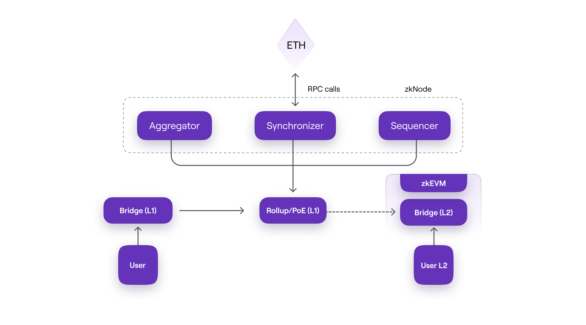
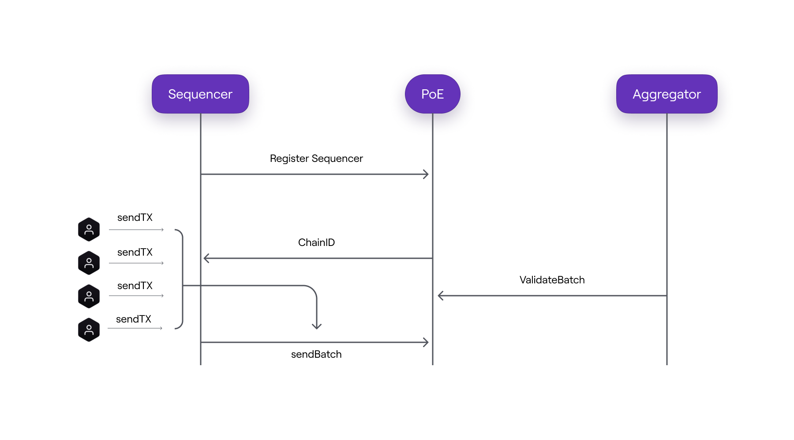
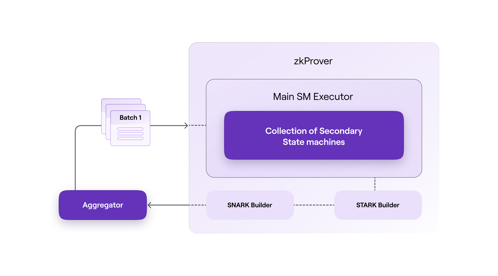
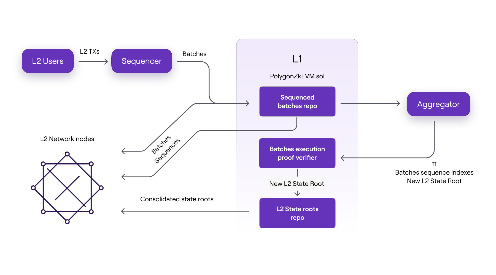
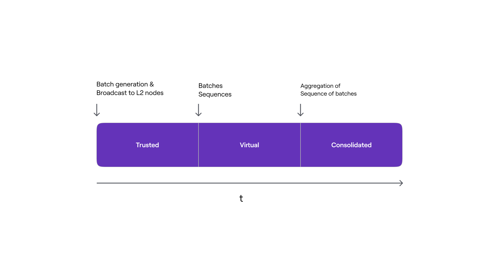
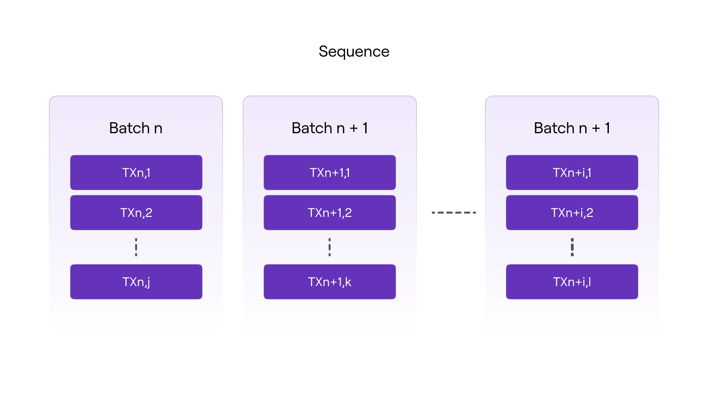
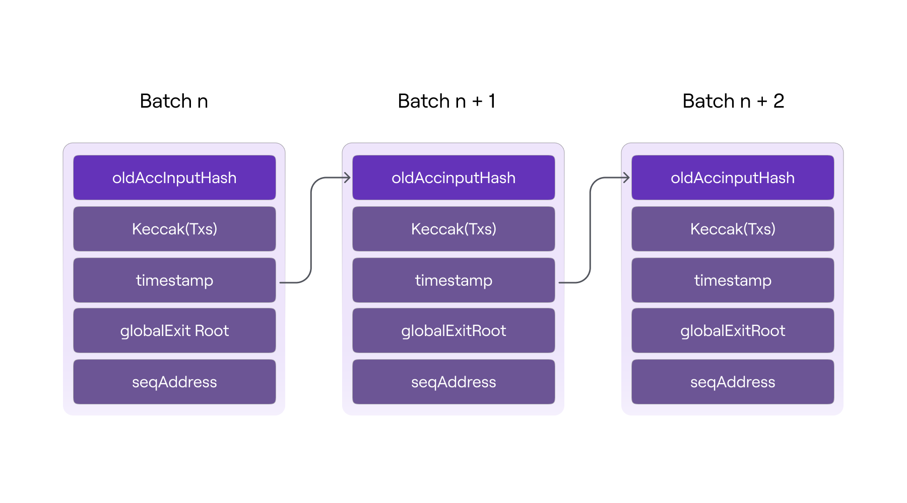
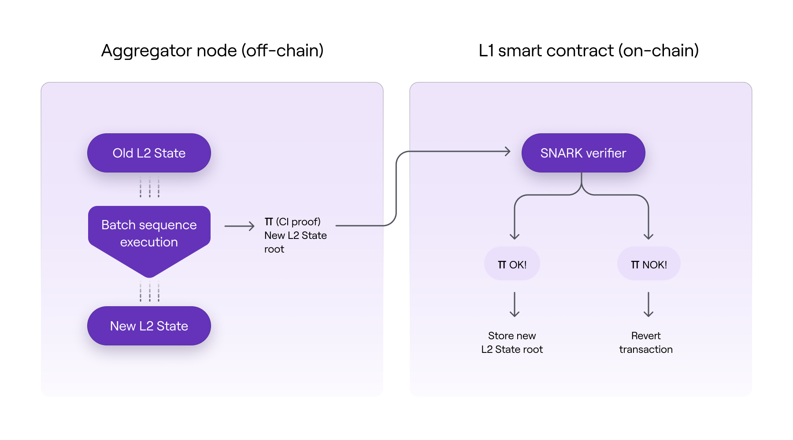
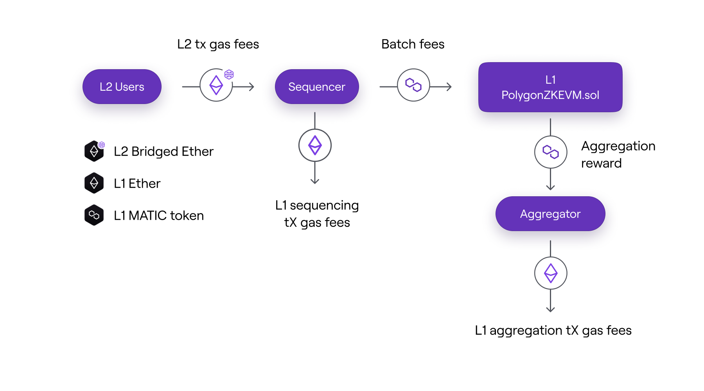
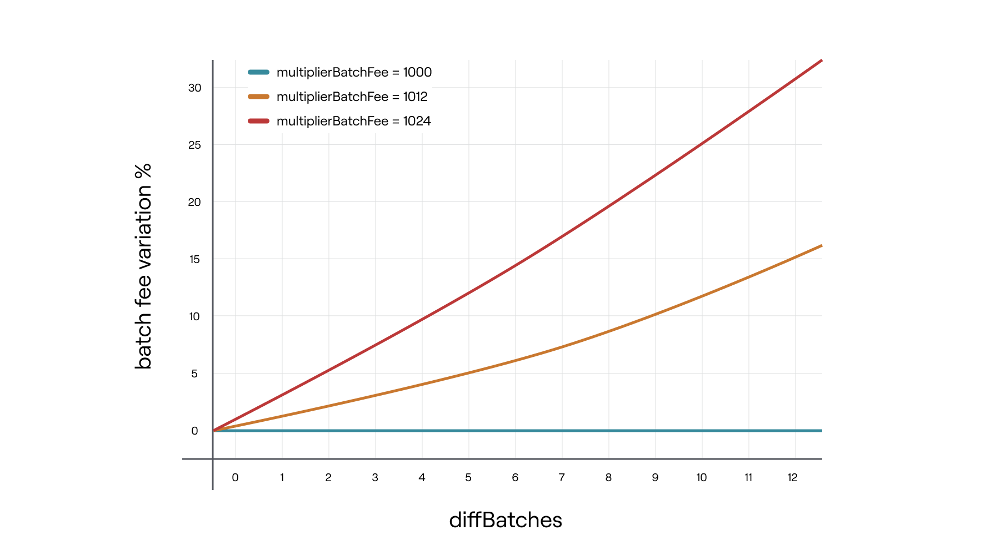

# Polygon zkEVM

# 简介

Polygon zkEVM是一种去中心化的以太坊2层可扩展性解决方案，它使用加密零知识证明为链下交易计算（也称为ZK-Rollup）提供有效性和快速最终性。ZK-Rollup通过发布零知识有效性证明透明地执行智能合约，同时保持与以太坊虚拟机的操作码兼容性。

## 使用zkEVM扩展以太坊

鉴于以太坊受制于区块链三角难题，它无法在不牺牲去中心化或安全性的情况下扩展到超过其交易门槛。这就是Polygon zkEVM发挥作用的地方。

Polygon zkEVM，是一种虚拟机，旨在通过重新创建所有现有的EVM操作码来模拟以太坊虚拟机 (EVM) ，以透明部署现有的以太坊智能合约。Polygon zkEVM开发了零知识汇总 (ZK-Rollups)，它运行在以太坊主网上，并以指数方式提高以太坊的可扩展性和每秒交易量 (TPS)。

为了证明链下计算的正确性，Polygon zkEVM采用可验证的零知识证明作为有效性证明。尽管2层零知识证明基于复杂的多项式计算来为链下交易提供验证和最终性，但有效性证明快速且易于验证。

作为状态机，zkEVM执行状态更改，这些更改来自用户发送到网络的以太坊2层交易的执行，并随后生成有效性证明，证明链下执行的状态更改的计算的正确性。

尽管采用这种革命性的设计方法是一个艰难的决定，但目标是尽量减少用户和开发人员在使用该解决方案时的摩擦。这是一种需要重新创建所有EVM操作码以透明部署现有以太坊智能合约的方法。为此，团队创建并设计了一套新的技术和工具。

## Polygon zkEVM的优势

* EVM等效
* 以太坊安全
* ZKP支持的可扩展性

Polygon zkEVM是以太坊的2层扩展解决方案，利用零知识证明的扩展能力，同时保持以太坊兼容性。Polygon zkEVM上的开发人员和用户可以使用他们在以太坊上使用的相同代码、工具、应用程序等，但具有更高的吞吐量和更低的费用。

开发人员将他们现有的合约部署到zkEVM，用户可以从以太坊存入资产并进行链下交易。这些交易被分成批次，零知识证明证明每笔交易的有效性。这保证了zkEVM的运营者无法窃取用户资金，可以说它继承了以太坊的安全性。

# 架构

Polygon zkEVM处理由以太坊第2层交易执行（用户发送到网络的交易）引起的状态转换。然后zkEVM创建有效性证明，利用零知识特性证明这些链下状态变化计算的准确性。

Polygon zkEVM的骨架架构如下图所示：



## zkEVM的主要组件

* 共识合约 (PolygonZkEVM.sol)
* zkNode
  * 同步器
  * 定序器和聚合器
  * RPC
* zkProver
* zkEVM Bridge

### 共识合约

早期版本Polygon Hermez 1.0基于捐赠证明(PoD)共识机制。PoD基本上是一种自动进行的去中心化拍卖，参与者（协调者）出价一定数量的代币，以便被选中创建下一批。

最新的共识合约(PolygonZkEVM.sol)在v1.0中利用了现有PoD的经验，并添加了对多个协调器的无许可参与以在L2中生产批次的支持。

早期的捐赠证明（PoD）机制是基于去中心化的拍卖模型来获得在特定时间范围内生产批次的权利。在这种机制中，建立了经济激励机制，因此验证者需要非常高效才能具有竞争力。

最新版本的zkEVM共识合约（部署在第1层）以[效率证明(PoE)](https://ethresear.ch/t/proof-of-efficiency-a-new-consensus-mechanism-for-zk-rollups/11988)为模型。它利用了v1.0中现有PoD的经验，并增加了对多个协调器的无许可参与以在L2中生产批次的支持。

#### 实施模式

共识合约模型利用现有的PoD机制，支持多个协调者的无许可参与，在L2中生产批次。这些批次是根据L1的汇总交易创建的。共识合约(PolygonZkEVM.sol)采用了一种更简单的技术，并且由于其在解决PoD中涉及的挑战方面效率更高而受到青睐。

基于合约共识的战略实施承诺确保网络：

* 保持其无许可功能以生成L2批次
* 高效，这是衡量整体网络性能的关键标准
* 达到可接受的权力下放程度
* 免受恶意攻击，尤其是来自验证者的攻击
* 在整体验证工作和网络价值之间保持公平的平衡

#### 链上数据可用性

完整的ZK-Rollup模式需要在链上发布数据（用户需要重建完整状态）和有效性证明（零知识证明）。然而，考虑到以太坊配置，在链上发布数据会产生gas价格，这是Layer 1的一个问题。这使得在Full ZK-Rollup配置和混合配置之间做出决定变得具有挑战性。

在混合模式下，以下任一情况都是可能的：

* Validium：数据存储在链下，只有有效性证明在链上发布。
* Volition：对于某些交易，数据和有效性证明都保留在链上，而对于其余交易，只有证明在链上。

除非，除其他事项外，可以高度加速证明模块以降低验证器的成本，否则混合模式仍然可行。

#### PolygonZkEVM.sol

zkEVM中的底层协议通过使用有效性证明来确保状态转换是正确的。为了确保遵循一组允许状态转换的预定规则，使用了共识合约（PolygonZkEVM.sol，部署在L1上）。

智能合约验证有效性证明，以确保每个转换都正确完成。这是通过使用zk-SNARK电路来实现的。这种类型的系统需要两个过程：事务批处理和事务验证。

为了执行这些程序，zkEVM使用两种类型的参与者：**定序器**和**聚合器**。在这个两层模型下：
* 定序器：向网络提出交易批次，即他们批量汇总交易请求并将它们添加到共识合约中。
* 聚合器：检查交易批次的有效性并提供有效性证明。任何无许可的聚合器都可以提交证明来证明状态转换计算的正确性。
因此，智能合约进行两次调用：一次是从定序器接收批次，另一次是从聚合器接收批次，请求验证批次。



#### 代币经济学

共识智能合约对定序器和聚合器提出了以下要求：

##### 定序器

* 任何拥有运行zkEVM节点所需软件的人都可以成为定序器。
* 每个定序器都必须以MATIC代币的形式支付费用，才能获得创建和提议批次的权利。
* 提议有效批次（由有效交易组成）的定序器受到交易请求者或网络用户支付的费用的激励。​

##### 聚合器

聚合器从定序器接收所有交易信息，并将其发送给Prover，Prover在复杂的多项式计算后提供一个小的zk-Proof。智能合约验证此证明。这样，聚合器收集数据，将其发送给证明者，接收其输出，最后将信息发送给智能合约，以检查证明者的有效性证明是否正确。

* 聚合器的任务是为定序器提出的L2交易提供有效性证明。
* 除了运行zkEVM的zkNode软件外，聚合器还需要专门的硬件来使用zkProver创建零知识有效性证明。
* 对于给定的一个或多个批次，提交有效性证明的聚合器首先赚取MATIC费用（由批次的定序者支付）。
* 聚合器需要表明他们验证交易的意图。之后，他们根据自己的策略竞争产生有效性证明。

### zkNode

zkNode是运行任何zkEVM节点所需的软件。网络需要一个客户端来实现同步并管理参与者（定序器或聚合器）的角色。Polygon zkEVM参与者将选择他们的参与方式：

* 作为知道网络状态的节点
* 作为批次生产过程中的任何两个角色的参与者: 定序器或聚合器

zkNode架构本质上是模块化的。

#### 激励构成

zkEVM网络的两个无需许可的参与者是：定序器和聚合器。已经设计了适当的激励结构来保持zkEVM网络的快速和安全。以下是排序器和聚合器的费用构成摘要：

* 定序器
  * 收集交易并批量发布
  * 从已发布的交易中收取费用
  * 支付L1交易费用 + MATIC（取决于待处理的批次）
  * MATIC进入聚合器
  * 盈利的条件：**txs费用** > **L1调用费用** + **MATIC费用**

* 聚合器
  * 处理定序器发布的交易
  * 构建zk证明
  * 接收来自定序器的MATIC
  * 静态成本：L1调用成本 + 服务器成本（构建证明）
  * 盈利的条件：**MATIC费用** > **L1调用费用** + **服务器成本**

### zkProver

zkEVM采用先进的零知识技术来创建有效性证明。它使用零知识证明器(zkProver)，旨在在任何服务器上运行，并被设计为与大多数消费类硬件兼容。每个聚合器都将使用此zkProver来验证批次并提供有效性证明。
它由一个主状态机执行器、一组辅助状态机（每个都有自己的执行器）、一个STARK证明构建器和一个SNARK证明构建器组成。



简而言之，zkEVM以多项式形式表示状态变化。因此，每个提议的批处理必须满足的约束是多项式约束或多项式恒等式。换句话说，所有有效的批次都必须满足特定的多项式约束。

### zkEVM Bridge

zkEVM桥是一个智能合约，允许用户在LX和LY两层之间转移他们的资产。zkEVM中的L1-L2是用于安全存取资产的去中心化桥梁。它是两个智能合约的组合，一个部署在一个链上，另一个部署在另一条链上。

zkEVM中的L1和L2合约除了各自的部署位置外是相同的。L1桥合约在以太坊主网上，以管理rollup之间的资产转移，而L2桥合约在特定的rollup上，负责主网和Rollup（或多个Rollup）之间的资产转移。

2层互操作性允许使用本机机制在不同的L2网络之间迁移资产。该解决方案嵌入在桥梁智能合约中。

### 验证者

验证者是一个智能合约，能够验证任何ZK-SNARK密码证明。这个SNARK验证器证明批次中每笔交易的有效性。它是任何zk-Rollup架构中的关键实体，主要原因是它验证证明的正确性以确保有效的状态转换。

测试网上验证者合约：**https://goerli.etherscan.io/address/0x8EdA1d8c254a77a57A6A7A1C0262e9A44A7C6D6d#code**

## 交易生命周期
在进入L2交易流程之前，用户需要一些资金来执行任何L2交易。为此，用户需要通过zkEVM Bridge dApp将一些以太币从L1转移到L2。

* 桥
  * 存入以太币
  * 等到**globalExitRoot**在L2上发布
  * 在L2进行认领并收到资金
* L2交易
  * 用户在钱包（例如Metamask）中发起tx并将其发送到定序器
  * 一旦定序器承诺添加他的交易，就会在L2上完成
  * 交易在L2上已经完成，但在L1上还没有完成（简单地说，L2状态还没有在L1上）。也称为可信状态。
  * 定序器将批次数据发送到L1智能合约，使任何节点能够以无需信任的方式（也称为虚拟状态）从L1同步
  * 聚合器将对未决交易进行验证并构建证明以实现L1的最终性
  * 一旦证明得到验证，用户的交易将达到L1最终确定性（对于提款很重要）。这称为合并状态。

上述过程是zkEVM中交易处理方式的概括。

## 设计特点

计划创建一个网络：无需许可、去中心化、安全、高效，并带有可验证的区块数据。

开发工作旨在实现无许可，即允许任何拥有zkEVM软件的人参与网络。例如，共识算法将让每个人都有机会成为定序器或者聚合器

数据可用性对于去中心化至关重要，因为每个用户都有足够的数据来重建汇总的完整状态。如上所述，团队仍然必须决定数据可用性的最佳配置。目的是确保没有审查制度，任何一方都无法控制网络。

zkEVM在设计时就考虑到了安全性。而作为L2解决方案，大部分安全性都继承自以太坊。智能合约将确保执行状态更改的每个人都适当地执行此操作，创建证明状态更改有效性的证明，并在链上提供有效性证明以供验证。

## 效率与整体策略

效率是网络性能的关键。zkEVM采用多种实现策略来保证效率。下面列出了其中的一些：

1. 第一个策略是部署共识合约，它激励最高效的聚合器参与证明生成过程。

2. 第二种策略是在链下执行所有计算，同时只在链上保留必要的数据和zk-proofs。

3. 桥智能合约的实现方式，比如以UTXO方式结算，仅使用Exit Tree Roots。

4. 在zkProver中使用专门的加密原语以加速计算并最小化证明大小，如下所示：
  * 运行特殊的零知识汇编语言(zkASM)来解释字节码
  * 使用zk-STARKs等零知识工具进行证明；这些证明虽然规模更大，但速度非常快。
  * zk-SNARK不是发布可观的zk-STARK证明作为有效性证明，而是用于证明zk-STARK证明的正确性。反过来，这些zk-SNARK作为状态更改的有效性证明发布。这有助于将gas成本从5M降低到350K。


========================================================================================================================================================================================


# zkEVM协议

## 简介

Polygon zkEVM是一种Layer 2 Rollup解决方案，它结合了以太坊区块链Layer 1中的数据可用性和执行验证，以确保L2状态转换的安全性和可靠性。

### 组件

zkEVM三个主要的组件是
* 可信定序器
* 可信聚合器
* 智能合约（PolygonZkEVM.sol，部署在L1）

#### 可信定序器

可信定序器组件负责接收来自用户的L2交易，对其进行排序，生成批次，并以序列的形式提交到共识合约的存储槽中。
定序器执行批量交易并将其广播到L2网络节点，以实现快速最终并降低与高网络使用率相关的成本。
可信定序器必须在定序器模式下运行一个zkEVM节点，并控制一个共识合约执行的以太坊账户。

#### 可信聚合器

可信聚合器组件可以根据可信定序器执行的L2交易批次计算L2状态。
另一方面，可信聚合器的主要作用是获取由可信定序器提交的L2批次，并生成证明批次计算完整性的零知识证明。这些ZK证明由聚合器使用特殊的链下EVM解释器生成。
共识合约的逻辑验证零知识证明，导致zkEVM继承L1安全性。在将新的L2状态根提交给共识合约之前需要进行验证。经过验证的证据是无可辩驳的证据，表明给定的批次序列导致了特定的L2状态。
可信聚合器应在聚合器模式下运行zkEVM节点，并且必须控制在共识合约中强制执行的特定以太坊帐户。

#### 共识合约

可信排序器和可信聚合器在与L1交互时使用的共识合约是PolygonZkEVM.sol合约。
可信定序器可以将批处理序列提交给L1并将它们存储在PolygonZkEVM.sol合约中，从而创建序列的历史存储库。
合约PolygonZkEVM.sol还使聚合器能够公开验证从一个L2状态根到下一个的转换。共识合约通过验​​证聚合器的ZK证明来实现这一点，证明交易批次的正确执行。

### zkEVM节点执行模式

zkEVM节点是一个软件包，包含运行zkEVM网络所需的所有组件。它可以以三种不同的模式运行：作为定序器、聚合器或RPC。

#### 定序器模式

在定序器模式下，节点持有一个L2State实例，管理批量广播到其他L2网络节点，并有一个内置的API来处理L2用户交互（交易请求和L2状态查询）。还有一个数据库用于临时存储尚未订购和执行的交易（待定交易池），以及与L1交互所需的所有组件，以便对交易批次进行排序并保持其本地L2状态最新。

#### 聚合器模式

在聚合器模式下，节点具有执行交易批处理、计算结果L2状态和生成计算完整性的零知识证明所需的所有组件。此外，具有获取由可信定序器在L1中提交的交易批次所需的所有组件，并调用函数来公开验证L1上的L2状态转换。

#### RPC

在RPC模式下，zKEVM节点的功能有限。它主要维护L2状态的最新实例，最初是关于可信定序器广播的批次，后来是从共识合约中获取的批次序列。该节点持续与L1交互，以保持本地L2状态最新，并检查L2状态根的同步。同步器的默认同步速率是每2秒一次，除非在配置中另有设定。

## 状态管理

### 无需信任的L2状态

可信定序器生成批次，通过广播通道与L2网络节点共享通过广播通道与L2网络节点共享，实现L2交易的快速最终并避免等待下一个L1块的需要。每个节点将运行批处理以在本地计算生成L2状态。
一旦可信定序器提交了直接从L1获取的批处理序列，L2网络节点将再次执行它们，它们将不再需要信任它。
批次的链下执行最终将通过零知识证明在链上进行验证，并将提交生成的L2状态根。随着zkEVM协议的处理，新的L2状态根将由L2网络节点直接从L1同步。

交易执行的数据可用性和验证仅依赖于L1安全假设，并且在协议的最后阶段，节点将仅依赖于L1中存在的数据来与每个L2状态转换保持同步。



L2节点可以通过图中所示三种不同的方式接收批次数据：
* 在批次提交到L1之前直接从可信定序器接收
* 批次排序后直接从L1接收
* 只有在聚合器执行被证明正确并由PolygonZkEVM.sol合约验证之后接收

L2节点按上面列出的时间顺序接收三种批次数据格式。

### 三个L2状态

L2状态分为三个阶段，每个阶段对应L2节点更新其状态的三种不同方式。这三种情况都取决于用于更新L2状态的批次数据的格式。
在第一个情况下，在L1上的任何数据可用之前，更新仅直接来自可信定序器的信息通知（即，由有序交易组成的批次）。由此产生的L2状态称为可信状态。
在第二种情况下，基于L2节点从L1网络检索的信息更新。也就是说，在对批次进行定序并在L1上提供数据之后。L2状态此时被称为虚拟状态。
在第三种情况下，用于更新L2状态的信息包括经过验证的计算完整性的零知识证明。也就是说，在L1中成功验证零知识证明后，L2节点将其本地L2状态根与可信聚合器在L1中提交的状态根同步。因此，L2状态此时被称为联合状态。

下图从批处理的角度描述了L2状态阶段的时间线，以及触发从一个阶段进展到下一阶段的动作。


## 交易生命周期

### 提交交易

Polygon zkEVM网络中的交易在用户的钱包中创建并使用他们的私钥签名。生成并签名后，交易将通过JSON-RPC接口发送到可信定序器的节点。然后交易被存储在待定交易池中，在那里等待定序器选择执行或丢弃。
用户和zkEVM使用完全兼容以太坊RPC的JSON-RPC进行通信。

#### zkEVM上的交易和区块 <font color="red">待确认是否一笔交易一个区块</font>

在目前的设计中，一笔交易相当于一个区块。这种设计策略不仅改进了节点之间的RPC和P2P通信，而且增强了与现有工具的兼容性并促进了L2中的快速终结。它还简化了定位用户交易的过程。

### 交易执行

可信定序器从池中读取交易并决定是丢弃它们还是排序并执行它们。已执行的交易被添加到一个交易批次中，并且定序器的本地L2状态被更新。
一旦将交易添加到L2状态，它就会通过广播服务广播到所有其他zkEVM节点。值得注意的是，依靠可信定序器，我们可以实现快速的交易最终（比L1更快）。但是，生成的L2状态将处于受信任状态，直到批次在共识合约中提交。

L1验证
用户通常会与受信任的L2状态进行交互。然而，由于某些协议特性，L2交易（在L1启用提款）的验证过程可能需要很长时间，通常大约30分钟，但在极少数情况下长达2周。因此，用户应该注意与高价值交易相关的潜在风险，尤其是那些无法逆转的风险，例如出口、场外交易和替代桥梁。

### 交易批处理

可信定序器必须使用**PolygonZkEVM.sol**合约中指定的以下**BatchData**结构对交易进行批处理：
```solidity
struct BatchData {
  bytes transactions;
  bytes32 globalExitRoot;
  uint64 timestamp;
  uint64 minForcedTimestamp;
}
```

#### transactions

这些是包含串联的批量交易的字节数组。每笔交易都使用RLP（递归长度前缀）标准根据以太坊EIP-155之前或EIP-155格式进行编码，且签名值v,r和s连接如下所示：
  1. **EIP-155之前**：rlp(nonce,gasprice,gasLimit,to,value,data)#v#r#s
  2. **EIP-155**：rlp(nonce,gasprice,gasLimit,to,value,data,chainid,0,0)#v#r#s

#### globalExitRoot

这是Bridge的Global Exit Merkle Tree的根，它将在批处理开始时同步到L2状态。Bridge在L1和L2之间传输资产，认领交易解锁目标网络中的资产。

#### timestamp

就像以太坊区块有时间戳一样，每个批次都有一个时间戳。每个时间戳必须满足两个约束，以确保批次按时间排序并与L1块同步：
  1. 给定批次的时间戳必须大于或等于最后一个排序批次的时间戳
  2. 可信定序器可以为批处理设置的最大批处理时间戳是执行排序L1交易的块的时间戳

#### minForcedTimestamp

如果批次是所谓的强制批次，则此参数必须大于零。通过使用强制批次来抵制审查。

### 批量定序

在批次成为L2虚拟状态的一部分之前，需要对批次进行排序和验证。
可信定序器使用L1 PolygonZkEVM.sol合约的映射成功地将一个批次添加到一系列批次中sequencedBatches，该映射基本上是一个存储结构，用于保存定义虚拟状态的序列队列。

```solidity
// SequenceBatchNum --> SequencedBatchData
mapping(uint64 => SequencedBatchData) public sequencedBatches;
```

批次必须是要排序的批次数组的一部分才能被排序。可信定序器调用PolygonZkEVM.sol合约，该合约使用其sequenceBatches映射，该映射接受要排序的批次数组作为参数。

```solidity
function sequenceBatches ( 
    BatchData[] memory batches
) public ifNotEmergencyState onlyTrustedSequencer
```

下图显示了批处理序列的逻辑结构。


#### 最大和最小批量大小

合约的公共常量MAX TRANSACTIONS BYTE LENGTH决定了一个批处理中可以包含的最大交易数（300000）。类似地，序列中的批次数量受合约的公共常量MAX VERIFY BATCHES（1000）限制。批次数组必须至少包含一个批次，并且不超过常量MAX VERIFY BATCHES的值。只有可信定序器的以太坊账户可以访问映射sequencedBatches。合约也必须不处于紧急状态。如果不满足上述条件，函数调用将被还原。

#### 批次有效性和L2状态完整性

该sequencedBatches函数遍历每批序列，检查其有效性。有效批次必须满足以下条件：
  * 它必须包含一个globalExitRoot存在于桥的L1合约PolygonZkEVMGlobalExitRoot.sol的GlobalExitRootMap中。只有包含有效的globalExitRoo，批次才有效。
  * 交易字节数组的长度必须小于常量MAX_TRANSACTIONS_BYTE_LENGTH的值。
  * 该批次的时间戳必须大于或等于最后一个被排序的批次的时间戳，但小于或等于执行排序的L1交易所在块的时间戳。所有批次必须按时间排序。

如果一个批次无效，交易将恢复，丢弃整个序列。否则，如果要定序的所有批次均有效，则定序过程将继续。

存储变量calledlastBatchSequenced用作批次计数器，因此每次对批次进行排序时它都会递增。它为每个批次提供一个特定的索引号，该索引号将用作批次链中的位置值。

区块链中用于将一个块链接到下一个块的相同哈希机制被用于批处理，以确保批处理链的密码完整性。也就是说，在用于计算下一批摘要的数据中包括前一批摘要。

因此，给定批次的摘要是所有先前排序的批次的累积哈希，因此称为批次的累积哈希，旧的用 oldAccInputHash 表示，新的用 newAccInputHash 表示。

特定批次的累积哈希具有以下结构：
```solidity
keccak256 ( 
    abi.encodePacked (
        bytes32 oldAccInputHash, 
        keccak256(bytes transactions), 
        bytes32 globalExitRoot ,
        uint64 timestamp ,
        address seqAddress
    )
)
```
其中：
**oldAccInputHash**是前一个排序批次的累积哈希值，
**keccack256(transactions)**是交易字节数组的Keccak摘要，
**globalExitRoot**是Bridge的Global Exit Merkle Tree根，
**timestamp**是批次时间戳，
**seqAddress**是批处理程序的地址。


如上图所示，每个累积的输入哈希确保当前批次数据的完整性（如transactions和timestamp，globalExitRoot以及它们的排序顺序）。

重要的是要注意，批处理链中的任何更改都会导致所有未来累积的输入哈希值不正确，表明由此产生的L2状态缺乏完整性。

只有在验证了序列中所有批次的有效性并计算了每个批次的累积哈希后，才使用以下SequencedBatchData结构将批次序列添加到sequencedBatches映射中。
```solidity
struct SequencedBatchData {
    bytes32 accInputHash;
    uint64 sequencedTimestamp;
    uint64 previousLastBatchSequenced;
}
```
其中，
**accInputHash**是该批次序列中最后一批的唯一密码指纹，
**sequencedTimestamp**是执行排序L1交易的块的时间戳，
**previousLastBatchSequenced**是当前序列的第一个批次之前的最后一个排序批次的索引（即，前一个序列的最后一个批次）。

当序列将输入到sequencedBatches映射时，序列中最后一批的索引号用作键，SequencedBatchData结构用作值。

#### BatchData最小存储

由于 L1 中的存储操作在gas消耗方面非常昂贵，因此尽可能少地使用它是至关重要的。为此，存储槽（或映射条目）仅用于存储序列承诺。

每个映射条目提交两个批处理索引。
  * 前一个序列的最后一批作为SequencedBatchData结构的值
  * 当前序列的最后一批作为映射键，
以及当前序列中最后一批的累积哈希值和时间戳。

重要的是要注意，仅保存序列中最后一批的累积哈希；所有其他的都是动态计算的，以便获得最后一个。

如前所述，哈希摘要将是整个批处理链的承诺。批次索引还提供有用的信息，例如序列中的批次数量及其在批次链中的位置。时间戳将序列锚定到特定时间点。

L2交易的数据可用性是有保证的，因为每一个批次的数据都可以从排序交易的calldata中恢复出来，这不是合约存储的一部分，而是L1 State的一部分。

最后事件SequenceBatches被发出。
```solidity
event SequenceBatches (uint64 indexed numBatch)
```
一旦批次在L1中成功排序，所有zkEVM节点都可以通过直接从L1合约PolygonZkEVM.sol获取数据来同步其本地L2状态，而不必单独依赖可信定序器。这就是达到L2虚拟状态的方式。

### 批量聚合

可信聚合器最终应聚合可信定序器先前提交的批次序列，以实现L2状态最后阶段，即合并状态。

聚合序列意味着成功地将生成的L2状态根添加到L1合约PolygonZkEVM.sol中的映射batchNumToStateRoot。这是一个包含所有合并的L2状态根的存储结构，这些根由每个聚合批次序列的最后一个批次索引作key保存。
```solidity
// BatchNum --> state root
mapping (uint64 => bytes32) public batchNumToStateRoot;
```
此外，聚合意味着成功验证了交易批处理执行的计算完整性的零知识证明。
SNARK（Succinct Non-interactive Arguments of Knowledge）是底层的零知识证明验证模式。其关键特征之一是证明的简洁性和验证速度。
因此，可以使用原始计算所需的一小部分计算资源来验证详尽计算的完整性。因此，通过使用SNARK模式，我们可以以节省gas的方式为详尽的链下计算提供链上安全性。



如上图所示，批处理的链下执行将假定L2状态转换，并因此更改为新的L2状态根。
聚合器生成执行的计算完整性（CI）证明，其链上验证确保生成的L2状态根的有效性。

#### Aggregating a Sequence of Batches
为了聚合一系列批次，可信聚合器必须调用**trustedVerifyBatches**方法：
```solidity
function trustedVerifyBatches (
  uint64 pendingStateNum,
  uint64 initNumBatch,
  uint64 finalNewBatch,
  bytes32 newLocalExitRoot,
  bytes32 newStateRoot,
  uint256 [2] calldata proofA,
  uint256 [2][2] calldata proofB,
  uint256 [2] calldata proofC
) public onlyTrustedAggregator
```
其中，
**pendingStateNum** 是待合并的状态转换数，只要可信聚合器处于运行状态，它就被设置为0。**pendingState**用作在L2状态由独立聚合器合并时使用的安全措施。
**initNumBatch** 是最后一个聚合序列中最后一批的索引。
**finalNewBatch** 是聚合序列中正被聚合的最后一批的索引。
**newLocalExitRoot** 是桥的L2 Exit Merkle Tree的根，在序列执行结束时用于在聚合序列时计算新的Global Exit Root，并允许桥声明transactions在L1中成功执行。
**newStateRoot** 是在较旧的L2状态上执行批次序列所产生的L2 StateRoot。
**proof(A,B和C)** 是零知识证明。

要成功聚合一系列批次，必须满足以下条件：
* 聚合交易必须从可信聚合器账户发出。
* **initNumBatch** 参数必须是已聚合批次的索引。也就是说，它必须在映射**batchNumToStateRoot**中有一个L2 State root。
* **initNumBatch** 参数必须小于或等于最后一个聚合批次索引。
* 要聚合的序列必须至少有一个批次。
* **initNumBatch**和**finalNewBatch** 参数必须是排序批次，也就是说，要出现在映射sequencedBatches中。
* 必须是成功验证计算完整性的零知识证明。

执行者（Executor）和证明者（Prover）是聚合器节点的服务，它们执行批处理并生成零知识证明。我们在这里将它们视为以太坊虚拟机黑盒解释器，它们可以：

* 在当前L2状态上执行一系列交易批处理
* 计算得到L2状态根
* 为执行生成计算完整性的零知识证明

证明/验证系统的设计方式使得成功的证明验证等同于密码证明在特定L2状态上执行给定的批处理序列会导致L2状态由参数**newStateRoot**表示。

以下代码片段是PolygonZkEVM.sol合约的一部分，它展示了零知识证明验证：
```solidity
// Get snark bytes
bytes memory snarkHashBytes = getInputSnarkBytes (
  initNumBatch,
  finalNewBatch,
  newLocalExitRoot,
  oldStateRoot,
  newStateRoot
);

// Calulate the snark input
uint256 inputSnark = uint256(sha256(snarkHashBytes)) % _RFIELD;

// Verify proof
require (
  rollupVerifier.verifyProof(proofA, proofB, proofC, [inputSnark]),
  "PolygonZkEVM :: _verifyBatches : Invalid proof"
);
```

##### rollupVerifier

**rollupVerifier**是一个外部合约，它有一个函数**verifyProof**，接受一个证明（**proofA**、**proofB**、**proofC**）、一个值**inputSnark**和返回一个布尔值，如果证明有效则返回**true**，否则返回 **false**。

证明的成功验证只是确认了计算的完整性，而不是使用了正确的输入以及它们产生了正确的输出值。公开论证用于公开披露被证明的计算的关键点，以证明它是使用正确的输入执行的并揭示输出。

这样，在证明验证过程中，L1智能合约将设置公共参数，以确保被证明的状态转换对应于可信定序器提交的批次的执行。

##### inputSnark

inputSnark是特定L2状态转换的256位唯一密码表示，用作公共参数。它被计算为一个名为**snarkHashBytes**字节字符串的**sha256 mod % _RFIELD**哈希（由于SNARK中使用的数学原语，需要模运算符）。

**snarkHashBytes**数组由称为**getInputSnarkBytes**的智能合约函数计算，它是一个ABI编码的打包字符串，包含以下值：
* msg.sender: 可信聚合器的地址。
* oldStateRoot: L2状态根，表示要证明的状态转换之前的L2状态。
* oldAccInputHash: 最后一批次聚合的累积哈希值。
* initNumBatch: 最后一批次聚合的索引。
* chainID: 唯一链标识符。
* newStateRoot: L2状态根，表示正在证明的状态转换后的L2状态。
* newAccInputHash: 正在聚合的序列中最后一批的累积哈希值。
* newLocalExitRoot: 序列执行结束时的桥的L2 Exit Merkle Tree根。
* finalNewBatch: 执行范围内最后一批次的编号。

inputSnark将表示特定L2状态转换的所有L2交易，以特定顺序执行，在特定L2（链 id）中，并由特定的可信聚合器（**msg.sender**）证明。 **trustedVerifyBatches**函数不仅会验证零知识证明的有效性，还会检查 InputSnark的值是否对应于待聚合的L2状态转换。

如果对**_verifyAndRewardBatches**的内部调用返回**true**，则意味着批次序列验证成功，然后将**newStateRoot**参数添加到映射**batchNumToStateRoot**中。序列中最后一批的索引将用作入口的键。

最后**TrustedVerifyBatches**事件将发出。
```solidity
event TrustedVerifyBatches (
  uint64 indexed numBatch,
  bytes32 stateRoot,
  address indexed aggregator
);
```

一旦批次在L1中成功聚合，所有zkEVM节点都可以通过直接从L1共识合约（PolygonZkEVM.sol）检索和验证合并根来验证其本地L2状态。结果，达到了L2合并状态。

## 激励机制

为确保系统的可持续性，参与者必须因正确履行其角色并赋予协议最终性而得到奖励。除非另有说明，此处提出的措施和规则适用于定序器和聚合器角色分散的情况（即，当没有可信定序器和可信聚合器时）。

### L2交易费用和排序费用

L2中使用的原生货币是Bridged Ether，它起源于L1。这是用于支付L2交易费用的货币。它可以以1:1的交换比例从L1转移到L2，反之亦然。

定序器赚取L2用户提交交易支付的交易手续费，直接从**Bridged Ether**中获得报酬。支付的费用金额取决于gas价格，gas价格由用户根据他们愿意为执行交易支付的费用设定。

为了激励每个排序批次的聚合器，定序器必须在L1合约PolygonZkEVM.sol中锁定一定数量的MATIC代币，数量与序列中的批次数量成比例。每批序列锁定的MATIC代币数量保存在batchFee变量中。

下图描述了协议参与者获得的各种费用和奖励。



为了最大化其收入，定序器优先考虑gas价格较高的交易。此外，有一个阈值，低于该阈值，定序器执行交易将无利可图，因为从L2用户那里赚取的费用少于为排序费用支付的费用（加上L1排序交易费用）。用户必须确保他们的交易费用高于此阈值，以便激励定序器处理他们的交易。

定序器对批处理序列进行排序所获得的Ether净值由以下表达式表示：
“Sequencer net Ether income”=totalL2TxGasFee−(L1SeqTxGasFees+(batchFee∗nBatches)/(MATIC/ETH))
​其中，
**totalL2TxGasFees**是从批序列中包含的所有L2交易中收集的费用总额，
**L1SeqTxGasFee是**L1中支付的定序交易gas费，
**batchFee**是PolygonZkEVM.sol合约中的存储变量费用，
**nBatches**是序列中的批次数，
**MATIC/ETH**是以ETH表示的MATIC代币的价格。

### 聚合奖励

聚合器也需要为正确履行其职责而获得奖励。聚合器每次聚合一个序列时获得的MATIC代币数量，用**batchReward**表示，由总合约MATIC余额和聚合的批次数决定。每批聚合获得的MATIC由L1合约PolygonZkEVM.sol在序列聚合之前使用以下表达式计算：
```
batchReward=“contract MATIC balance”/“Quantity of batches not aggregated yet”
```
以下表达式表示聚合器将从一系列批次的聚合中获得的ETH价值总量：
```
“AggregatornetEtherincome”=(batchReward∗nBatches)/(MATIC/ETH)−L1AggTxGasFee
```
其中：
**L1AggTxGasFee** 是在L1中支付的聚合交易gas费，
**batchReward** 是每批累计赚取的MATIC数量,
**nBatches** 是序列中的批次数量，
**MATIC/ETH** 是以ETH表示的MATIC代币的价格。

### 变量**batchFee**重新调整

batchFee由独立聚合器对序列的每次聚合进行自动调整序。

当可信聚合器无法正常工作并且常量**batchFee**需要更改以鼓励聚合时，就会发生这种情况。在接下来的部分中提供了有关可信聚合器不活动或故障的更多信息。

称为**_updateBatchFee**的内部方法用于调整存储变量**batchFee**。
```solidity
function _updateBatchFee(uint64 newLastVerifiedBatch) internal
```

管理员定义了两个用于费用调整方法的存储变量：
* veryBatchTimeTarget：这是验证批次的目标时间，因此将更新变量batchFee以实现此目标
* multiplierBatchFee：是批量费用乘数，保留3位小数，取值范围为1000到1024。
该函数**_updateBatchFee**首先确定有多少聚合批次迟到了。即那些在序列中但还没有聚合的。
第二，经过了多少时间，如**veryBatchTimeTarget**所示。

该**diffBatches**变量表示后期批次与低于目标批次之间的差异，并且它的值受常量MAX BATCH MULTIPLIER限制，该常量值为12。

#### 案例1

如果在聚合序列中晚批次多于早批次，则以下公式将应用于存储变量**batchFee**：

$“new batch fee”=“old batch fee” \times \frac{multiplierBatchFee^{diffBatches}}{10^{3 \times diffBatches}}$

下图显示了当晚的批次主导序列时，变量batchFee的百分比变化取决于不同multiplierBatchFee值的diffBatches值。应该注意的是，目标是增加聚合奖励以激励聚合器。



#### 案例2

如果早批次的数量超过晚批次，则将以下公式应用于存储变量**batchFee**：

$“new batch fee”=“old batch fee” \times \frac{10^{3 \times diffBatches}}{multiplierBatchFee^{diffBatches}}$

The graph below shows the percentage variation of the **batchFee** variable depending on the **diffBatches** value for different values of **multiplierBatchFee** when batches below the time target dominate the sequence. It should be noted that the goal is to reduce the aggregation reward.


## 协议可升级性
## 管理员角色和治理
## 抗故障性
## zkEVM桥
## EVM和zkEVM

# zkNode
# zkProver
# zk Assembly
# 多项恒等式语言

==========================================================================================================================================


## 运行本地zkNode

[启动本地节点说明](https://zkevm.polygon.technology/docs/setup-local-node)


文档层叠到 zkEVM 子组件的更详细信息，包括零知识证明器 (zkProver)、zkProver 中使用的状态机、 zkEVM Bridge 智能合约以及使 Polygon zkEVM 能够实现其目标的特殊工具.


Polygon zkEVM 术语表
1层
Layer1或基础区块链是安装汇总智能合约的地方。它是以太坊或以太坊的测试网，但它可以是任何 EVM 兼容的区块链。

2层
Layer2指的是rollup网络；在这里指Polygon zkEVM网络。

共识合约 (PolygonZkEVM.sol)
Polygon zkEVM网络使用的共识机制。它由部署在第1层（在本例中为以太坊）的智能合约执行。

批
一组使用 zkProver 执行/证明并发送到/从L1同步的交易。

音序器
zkEVM 参与者，负责选择交易，将它们按特定顺序排列，并分批发送给 L1。

值得信赖的定序器
具有特殊权限的音序器。只能有一个可信的排序器。授予可信排序器的特权允许它预测将应用于L1的批次。这样，它可以在与L1交互之前提交特定序列。这样做是为了实现快速的最终确定并降低与使用网络相关的成本（降低汽油费）。

未经许可的定序器
网络上任何人都可以执行的定序器角色。尽管与可信排序器相比它具有竞争劣势（如最终确定性较慢或 MEV 攻击），但其主要目的是对网络实施去中心化和审查抵抗。

顺序
可信排序器发送到L1以更新状态的批处理组和其他元数据。

强制批处理
由未经许可的排序器发送到L1以更新状态的批处理。
L2块
与L1块相同，但用于 L2。它主要由 JSON-RPC 接口使用。

目前，所有L2区块都设置为仅包含一笔交易。这样做是为了实现即时终结。因此，不必关闭批处理以允许 JSON-RPC 公开已处理事务的结果。

可信状态
L2 状态由可信定序器提交。

虚拟状态
处理已经提交给L1的交易后达到的状态。这些交易由受信任的或未经许可的排序器分批发送。这些批次也称为虚拟批次。这种状态是无信任的，因为它依赖于 L1（这里是以太坊）来保证安全。

合并状态
通过提交 ZKP（零知识证明）在链上证明状态，证明最后一个虚拟批次的序列的执行。

无效交易
无法处理且不影响网络状态的事务。这样的交易可以包含在虚拟批次中。交易无效的原因可能与：

以太坊协议：无效的随机数，余额不足等
zkEVM 引入的限制：每个批次可以利用有限数量的资源，例如可以计算的 keccak 哈希总量。
恢复交易
已执行但被还原的交易（由于智能合约逻辑）。无效交易和还原交易之间的主要区别在于还原交易会修改状态，至少会增加发送方的随机数。


